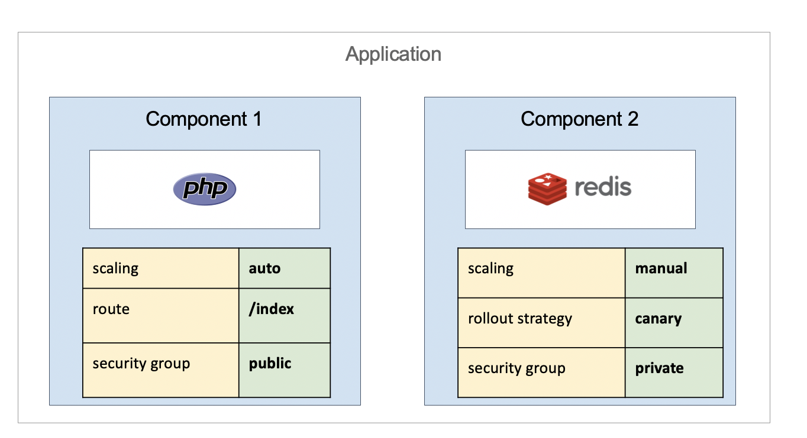

# 1. Purpose and Goals

The main goal of Open Application Model is to enable platform builders to create cloud native application platforms with a standard, runtime-agnostic model. The specification is designed to be agnostic to any specific container runtime, orchestration software, cloud provider, or hardware configuration, with clearly defined roles for developers, operators and platform builders, while still allowing implementations to make use of the native APIs, tools, and features that are unique to the implementation and its underlying runtime.  

The central problem this specification seeks to address is: when building a cloud native platform, how the distributed applications can be modeled and handed off to those responsible for operating them.

For example, a contemporary cloud application may be composed of dozens of microservices, each responsible for a discrete chunk of what, broadly speaking, is "an application." Such applications need to be configured, deployed, audited, updated, and deleted. Sometimes the application must be treated as a whole, and sometimes finer levels of granularity are required. And most importantly, often such applications are managed not by one person or one team, but by multiple teams who must cooperate to achieve reliability, stability, and timeliness.

This specification provides a description of such applications, where the description is aimed at modeling microservices by default, with operational strategies as part of the application definition, and configure by user intention. Furthermore, it suggests patterns and processes for managing such applications. The specification describes a model for cloud native (i.e., highly distributed) applications, encompassing public cloud technologies, on-prem solutions, and IoT/edge technologies. By specifying a common model, this specification provides a foundation for multiple implementations of a shared description of cloud native applications.

Additional goals of the specification are to:

- Define __roles and responsibilities__ with respect to the component and application models.
- Define __building-block objects__ for platform builders.
- Promote the genesis of multiple, __differentiated__ implementations of both tooling and runtimes which can operate on a common class of components and applications.

Non-goals include:

- Defining or prescribing specific development or operational workflows.
- Defining the schemas of operational resources, for example (but not limited
  to):
  - Secrets (secure, encrypted values)
  - Networks
  - Volumes
- Describing or defining the runtimes themselves.

| Next Part     |
| ------------- |
| [Overview and Terminology](2.overview_and_terminology.md)|
