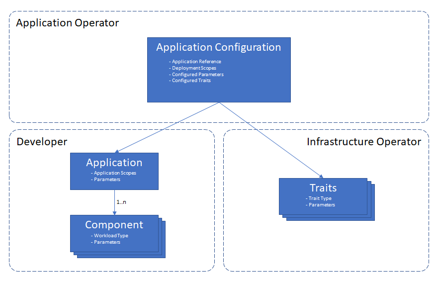

# 1. Purpose and Goals

The central problem this specification seeks to address is how cloud-oriented applications can be composed and then successfully handed off to those responsible for operating them. The problem is not so much about how to write programs, but how to take components of a service oriented (or microservice oriented) architecture, and streamline the workflow that surrounds such applications.

For example, a contemporary cloud application may be composed of dozens of microservices, each responsible for a discrete chunk of what, broadly speaking, is "an application." Such applications need to be configured, deployed, audited, updated, and deleted. Sometimes the application must be treated as a whole, and sometimes finer levels of granularity are required. And most importantly, often such applications are managed not by one person or one team, but by multiple teams who must cooperate to achieve reliability, stability, and timeliness.

This specification provides a description of such applications, where the description is aimed at separating the concerns of developers from the concerns of operators. Furthermore, it suggests patterns and processes for managing such applications. The specification describes a model for cloud native (i.e. highly distributed) cloud applications, encompassing public cloud technologies, on-prem solutions, and IoT/edge technologies. By specifying a common model, this specification provides a foundation for multiple implementations of a shared description of cloud native applications.

This open specification defines the following model:

- __Component__, where developers declare the operational characteristics of the code they deliver _in infrastructure neutral terms_.
- __Scopes__, a way to loosely couple components into groups with common characteristics.
- __Applications__, where developers group components together into a single, deployable unit and specifies cross-component info, such as health scopes.
- __Traits__ for assigning operational features to instances of components.
- __Application configuration__, defines a configuration of an application, its traits, and additional scopes, such as network scopes.
- __Workload types and configurations__, which describe the underlying runtime for a particular workload, as well as exposing per-application configuration.

Additional goals of the specification are to:

- Define __roles and responsibilities__ with respect to the component and application models.
- Promote the genesis of multiple, _differentiated_ implementations of both tooling and runtimes which can operate on a common class of components and applications.

Non-goals include:

- Defining or prescribing specific development or operational workflows.
- Defining the schemas of operational resources, for example (but not limited
  to):
  - Secrets (secure, encrypted values)
  - Networks
  - Volumes
- Describing or defining the runtimes themselves

| Next Part        | 
| ------------- |
| [2. Overview and Terminology](2.overview_and_terminology.md)| 
