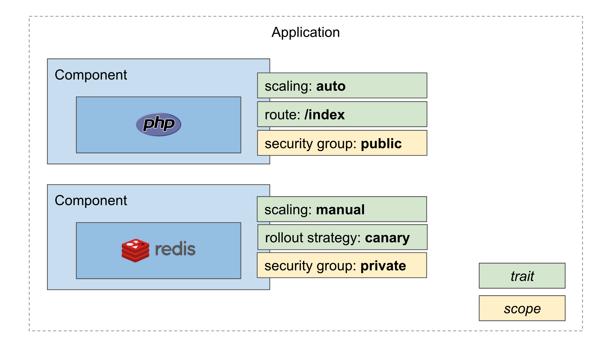

# 2. Overview and Terminology

This section provides an overview of the Open Application Model (OAM) and its terminology. It begins by identifying the organization roles that are involved in the process of running cloud native applications. From there, it lays out the specific terminology that is used throughout this document.

## Roles and Responsibilities

As a foundation for the specification, several roles and corresponding responsibilities like application developers, application operators and infrastructure operators are defined in OAM specification, please check [personas documentation for more detail](./introduction.md). 

## Overview of the Model

This specification proposes a model that defines cloud native applications as follows:

> A cloud native application is a collection of interrelated, but discrete _components_ (services, tasks, workers) that, when coupled with configuration and instantiated in a suitable runtime, together accomplish a unified functional purpose.

This specification defines the following application constructs for application developers and application operators to design and operate applications:

- __Component__, which defines a runnable unit and declares its characteristics _in infrastructure neutral terms_.
- __Traits__ for assigning operational features to instances of components.
- __Application scopes__, for grouping components into loosely coupled applications with common characteristics.
- __Application configuration__, which delineates a deployment of components, their traits, and application scopes.





In addition, the specification defines the following definition constructs for infrastructure operators and platform builders to register and discover the components, traits, and scopes that are available on a given platform:

- __Workload Definition__, where platforms register a specific type of workload, such as containers, functions, or data stores, that developers use to create components.
- __Trait Definition__, where platforms register the schema of a specific kind of trait.
- __Scope Definition__, where platforms register the schema of a specific kind of application scope.

Thus, OAM defines an _application_ as a collection of _components_ each with a set of operational traits and scoped together into one or more application boundaries, and platform builders are free to register any capability as new workload types or traits/scopes. This essentially bring an application centric but highly extensible abstraction layer for any runtime which implemented OAM primitives.


## Terminology

The following terms are used throughout this specification.

### Component

__Components__ enable __developers__ to declare the characteristics of the code they deliver _in infrastructure neutral terms_. Apart from not burdening developers with infrastructural concerns, this frees operators and runtimes to meet a component's infrastructural needs in whatever opinionated manner they see fit.

A component is composed of the following pieces of information:

- Metadata: Information _about_ the component, primarily directed toward the application operator
- Workload template: A template about how to configure this component according to its workload definition
- Parameters: The parameters that can be adjusted during application runtime

### Traits

A trait defines a piece of add-on functionality that pertains to the operation of a component. Traits may be limited to certain workload types, and different OAM implementations may supply or support a different set of traits. Traits represent features of the system that are operational concerns, not developer concerns. For example, a developer may know whether or not their component can be scaled (and so choose a workload type that declares this). But an operator may decide to apply a manual scaling trait or an autoscaler trait to this component.

A trait is described as:

- Metadata: Information about the trait
- Applies-to list: Enumeration of workloads types to which this trait applies
- Definition reference: A reference to a schema that defines the trait

### Application Scopes

Application scopes provide different ways to group components into applications. Components are added to scopes by applying the name of the scope as a label on the component. Each scope represents some associated behavior or functionality. For example, grouping components into a network application scope would provide network visibility to all components within the scope.

An application scope is described as:

- Metadata: Information about the scope
- Allow overlap: Specifies whether a component can exist in multiple instances of the scope type
- Definition reference: A reference to a schema that defines the scope

### Application Configuration

An application configuration is a resource that declares how all parts of an application are to be instantiated and configured.

An application configuration has the following parts:

- Metadata: Information about the installed application configuration
- Components: A list of components to instantiate and run. Application operators apply traits to those component instances and supply values to parameters defined by the component author here.
- Scopes: Setup application scopes

### Definition Objects


#### Workload Definitions

A platform that implements OAM supplies a runtime (or runtimes) that can execute
components. Each type of workload that a component can run by the OAM runtime is represented by a _workloadDefinition_ that describes the following:

- Metadata: Information about the workload kind
- Definition reference: A reference to a schema that defines the workload. The schemas are mostly provided by the OAM
 platform.  

#### Trait Definition

A platform that implements OAM defines the traits that are available on that platform using a *traitDefinition* that describes the following:

- Metadata: Information about the trait kind
- Definition reference: A reference to a schema that defines the trait.  

#### Scope Definition

A platform that implements OAM defines the application scopes that are available on that platform using a *scopeDefinition* that describes the following:

- Metadata: Information about the scope kind
- Definition reference: A reference to a schema that defines the scope.

## Representing OAM Objects as Schematics

The OAM specification represents OAM objects (workload definitions, components, trait definitions, application configurations, etc.) as _schematics_.
A schematic is a structured document that provides a declaration of an object or an object's desired state. Throughout this specification, schematics are represented in [YAML](https://yaml.org/). However, nothing in this specification precludes the possibility of representing schematics as JSON documents or other similarly structured textual or binary representations.

### The Structure of a Schematic

OAM schematics adopts [Kubernetes Resource Model](https://github.com/kubernetes/community/blob/master/contributors/design-proposals/architecture/resource-management.md) so they all follow a similar pattern. Top-level attributes indicate the type of schematic, including its group, version, and kind (see above). A `metadata` section provides information about a particular schematic. All schematics defined in this specification use the same `metadata` attributes, as defined below. Finally, a `spec` section provides the _specification_ for the schematic. For example, the `spec` section of a [Trait](6.traits.md) describes the trait itself, while the `spec` section of an [Application Configuration](7.application_configuration.md) describes the components and traits that together comprise an application deployment.

The following example of a [Component](3.component.md) exhibits all three of these sections:

```yaml
apiVersion: core.oam.dev/v1alpha2   ## Group and version
kind: Component                     ## Kind
metadata:                           ## Metadata
  name: nginx-replicated
spec:                               ## Specification
  workload: 
    type: Server
    spec:
      os: linux
      containers:
        - name: server
          image: nginx:latest
status:
```

For now, the `status` section (i.e. the observed state of the object) is not enforced by OAM specification because not every runtime system follows the reconciliation mechanism of Kubernetes. That being said, `status` is required in Kubernetes implementation and it's highly recommend to define it clearly or import [OAM Kubernetes runtime](https://github.com/crossplane/oam-kubernetes-runtime) as your dependency.

The metadata section is common across all defined schematics and could be considered as a subset of [Kubernetes metadata](https://github.com/kubernetes/community/blob/5df5993d07f26b97c6370cbd1a9662f3aa1e9533/contributors/devel/sig-architecture/api-conventions.md#metadata). The platform builders are free to import Kubernetes [metadata library](https://github.com/kubernetes/apimachinery/blob/master/pkg/apis/meta/v1/types.go) or implement their own based this [metadata specification](./metadata.md).

## Further Reading

[A relation diagram for a real world OAM application](./assets/relations_between_various_OAM_resources.png) 


| Previous Part        | Next Part          |
| ------------- |-------------|
|[1. Purpose And Goals](1.purpose_and_goals.md)| [3. The Component Model](3.component.md)|
