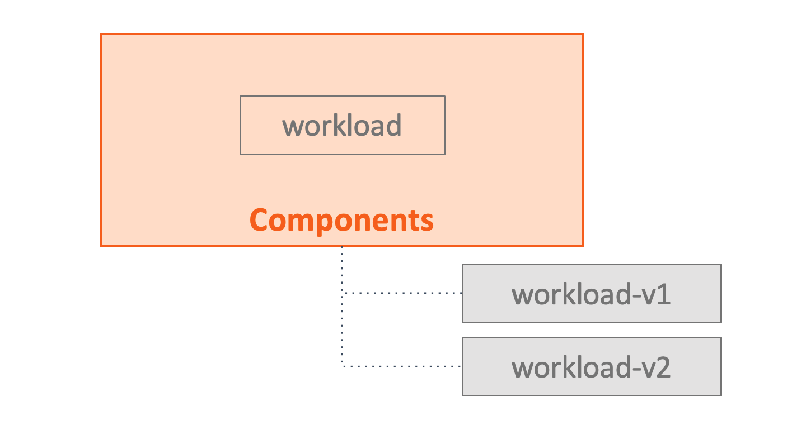

# 3. Components

This section defines components.

The role of a component is to enable developers use OAM application platform to declare, in infrastructure-neutral format, the characteristics of a discrete unit of execution.

Components describe functional units that may be instantiated as part of a larger distributed application. For example, each microservice in an application is described as a component. The description itself is not an instance of that microservice, but a declaration of the operational capabilities of that microservice. The [Application Configuration](7.application_configuration.md) describes how components are grouped together and how instances of those components are then configured.

## Representation

All component schematics are canonically represented as JSON and can be validated using the provided JSON Schema. Because it is more amenable for human consumption, YAML is also supported, and most of the examples are given in YAML. For the sake of validation, YAML may be converted to an equivalent JSON representation before validating it against the JSON Schema.

### Top-Level Attributes

The following attributes are common across all schemata defined in this document. They follow the [Kubernetes API convention](https://kubernetes.io/docs/concepts/overview/working-with-objects/kubernetes-objects/#required-fields).

The attributes below provide top-level information about the component definition.

| Attribute | Type | Required | Default Value | Description |
|-----------|------|----------|---------------|-------------|
| `apiVersion` | `string` | Y || A string that identifies the version of the schema the object should have. The core types uses `core.oam.dev/v1alpha2` in this version of specification. |
| `kind` | `string` | Y || Must be `Component`. |
| `metadata` | [`Metadata`](2.overview_and_terminology.md#metadata) | Y | | Information about the component. |
| `spec`| [`Spec`](#spec) | Y || A specification for component attributes. |

### Spec

The spec defines the constituent parts of a component.

| Attribute | Type | Required | Default Value | Description |
|-----------|------|----------|---------------|-------------|
| `type` | string | N | | The type of workload. |
| `settings` | [`WorkloadSettings`](#workloadsettings) | N | | The workload-specific configuration. |
| `parameters` | [`[]Parameter`](#parameter) | N | | The component's configurable parameters. |
| `workload` | [`Workload`](#workload) | N | | <kbd>LEGACY</kbd> The full specification of workload that should be passed to the runtime. This field is mutually exclusive with `type` and `settings`.|

#### Type

In practice, the available workload types are registered by infrastructure operators/platform builders to the platform following OAM specification. We will explain this in detail in next chapter: [workload definitions](4.workload_definitions.md).

#### WorkloadSettings

This section is the location for specifying workload-specific configuration whose structure is determined by the [definition reference](4.workload_definitions.md#DefinitionRef) of corresponding `WorkloadDefinition`. 

The implementation will use `WorkloadSettings` as the **template** to generate the instances of given workload type. For example, in Kubernetes implementation, a `Server` component would generate multiple immutable revisions of Deployment such as `frontend-v1` and `frontend-v2` upon every modification based on its `WorkloadSettings`.



#### Parameters

The Parameters section defines all of the configurable parameters for this component.

| Attribute | Type | Required | Default Value | Description |
|-----------|------|----------|---------------|-------------|
| `name` | `string` | Y | | The parameter's name. Must be unique per component. |
| `description` | `string` | N | | A description of the parameter. |
| `fieldPaths` | `[]string` | Y | | JSON field paths. |
| `required` | `boolean` | N |`false` | Whether a value _must_ be provided when authoring an applicationConfiguration including this component. |

Parameter `name` fields must be Unicode letter and number characters. Application Configurations will specify parameters values using this name.

Parameter `fieldPaths` specifies an array of fields within this Component's workload that will be overwritten by the value of this parameter. `fieldPaths` are specified as JSON field paths without a leading dot, for example `spec.containers[0].image`. The type of the parameter is inferred by the type of the fields to which those paths refer. Thus, all fields to which those paths refer MUST have the same type and MUST NOT be object type.

### Examples

This section illustrates a component describes `Server` workload.

```yaml
apiVersion: core.oam.dev/v1alpha2
kind: Component
metadata:
  name: frontend
  annotations:
    version: v1.0.0
    description: >
      Sample component that describes a very cool workload.
spec:
  type: Server # <--- the type of the workload
  settings: # <---- the settings of the workload
    osType: linux
    containers:
    - name: my-cool-workload
      image: example/very-cool-workload:0.1.2@sha256:verytrustworthyhash
      resources:
        cpu:
          required: 1.0
        memory:
          required: 100MB
      cmd:
      - "bash lscpu"
      ports:
      - name: http
        value: 8080
      env:
      - name: CACHE_SECRET
      livenessProbe:
        httpGet:
          port: 8080
          path: /healthz
      readinessProbe:
        httpGet:
          port: 8080
          path: /healthz
  parameters: 
  - name: imageName
    required: false
    fieldPaths: 
    - "settings.containers[0].image"
  - name: cacheSecret
    required: true
    fieldPaths:
    - "settings.containers[0].env[0].value"
```

> The component above assumes a `WorkloadDefinition` named `Server` exists in the system.


#### Implicit Workload Type <kbd>LEGACY</kbd>

> NOTE: this is a legacy feature, but it will be kept supported in OAM Kubernetes runtime until further notice since there are known adoptions.

##### Workload

The `workload` field is unstructured and its schema is determined by [definition reference](4.workload_definitions.md#DefinitionRef) as well. The main use case for this section is for _implicit workload type_.

Implicit workload type allowed users to directly define Kubernetes API resource with `apiVersion` and `kind` in component and indicates its workload type is implicit:

```yaml
# This is a legacy example
apiVersion: core.oam.dev/v1alpha2
kind: Component
metadata:
  name: frontend
spec:
  workload:
    apiVersion: core.oam.dev/v1alpha2
    kind: ContainerizedWorkload
    spec:
      osType: linux
      containers:
      - name: my-cool-workload
        image: example/very-cool-workload:0.1.2@sha256:verytrustworthyhash
```

Note that implicit workload type must assume below `WorkloadDefinition` exist in the system:

```yaml
# This is a legacy example
apiVersion: core.oam.dev/v1alpha2
kind: WorkloadDefinition
metadata:
  name: containerizedworkloads.core.oam.dev # <--- must be the same with apiGroup + Kind in the component, as well as the definitionRef.name below.
spec:
  definitionRef:
    name: containerizedworkloads.core.oam.dev
```

| Previous Part        | Next Part           | 
| ------------- |-------------| 
|[2. Overview and Terminology](2.overview_and_terminology.md)|  [4. Workload Definition](4.workload_definitions.md) | 
