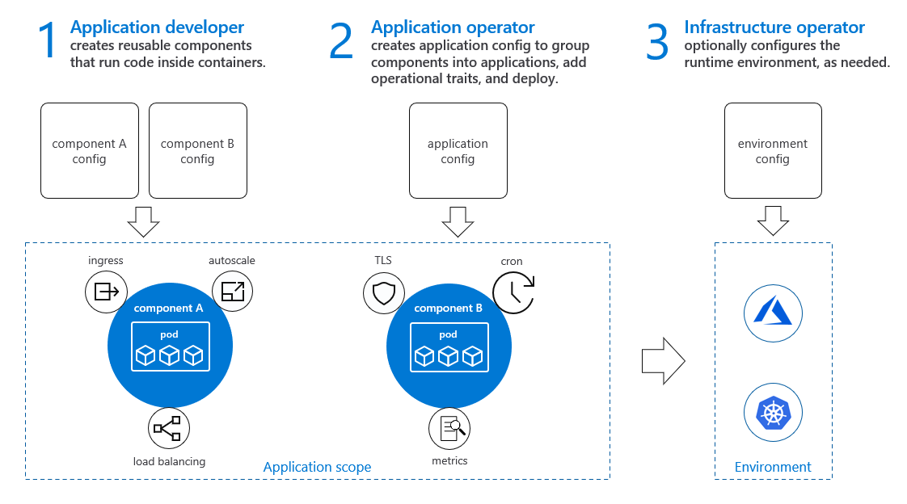

# Open Application Model Specification

Open Application Model is a runtime-agnostic specification for building cloud native application platforms.

Focused on **application** rather than container or orchestrator, _Open Application Model_ brings modular, extensible, and portable design for building application centric platforms on any runtime systems like Kubernetes, cloud, or IoT devices.

> **NOTICE:** The current working draft of OAM specification (0.2.x release) is under pre-beta release, which means the specification is still under development but will keep backward compatibility for any further change.

## Introduction

Developers think in terms of application architecture, not of infrastructure.

Open Application Model defines a number of standard but extensible abstractions to model micro-service applications by natural, with operation configurations as part of the application definition. This enables platform builders to create platforms around a unified model, with app-centric mindset by default, and essentially changes building platforms into developing modularized components and traits for the application. 

### Why Open Application Model?

For platform builders who create the application platform:
- Higher level abstractions - building developer facing platforms by default.
- Highly extensible - bring your own abstractions or capabilities.
- Clarity and manageability - leveraging modularized and re-usable building blocks.
- No capability lock-in - decoupled abstractions and implementation.

For end users of the OAM based platform:
- Think applications, not containers or orchestrators.
- Build modern applications by default.
- Operation is part of the application lifecycle.

### Team-centric and separation of concerns

Open Application Model proposed a clear separation of concerns between the parts that developers are responsible for, and the parts that operators and platform engineers are responsible for. For more details, see [introduction.md](./introduction.md).

## Read the specification

|                                | Latest Release |    Working Draft                  |
| :----------------------------: | :------------: |:--------------------------------: |
| **Core Specification:**        |
| OAM Specification              | [v0.2.1](https://github.com/oam-dev/spec/blob/v0.2.1/SPEC_LATEST_STABLE.md) |  [v0.2.2-WD](SPEC.md)  |

## See it in action

[OAM Kubernetes Runtime](https://github.com/crossplane/oam-kubernetes-runtime) is the officially maintained OAM plugin for Kubernetes.

## Community

### Milestones

To get an overview of the milestones and their description please visit the [Milestones](https://github.com/oam-dev/spec/milestones) page. 

### Triaging 

Triaging of items into milestones will occur during the bi-weekly community call. During this call, issues might be brought into milestones, removed from milestones or moved between milestones. 

### Contributing

See the [CONTRIBUTING](CONTRIBUTING.md) guide for more information about submitting changes to the spec.

One of the easiest ways to contribute is to participate in discussions. There are several ways to get involved.

| Item        | Value  |
|---------------------|---|
| Mailing List | https://groups.google.com/forum/#!forum/oam-dev |
| Community meeting info | [Bi-weekly (Starting Oct 22, 2019), Tuesdays 10:30AM PST](https://calendar.google.com/calendar?cid=dDk5YThyNGIwOWJyYTJxajNlbWI0a2FvdGtAZ3JvdXAuY2FsZW5kYXIuZ29vZ2xlLmNvbQ)  |
| Meeting link | https://zoom.us/j/271516061 |
| APAC Friendly Community meeting | [Bi-weekly APAC (Starting May 19, 2020), Tuesdays 19:00PM GMT+8](https://calendar.google.com/calendar?cid=OGFhaDBxbjBqZDM0c25jamM5bmQ1OXZxajBAZ3JvdXAuY2FsZW5kYXIuZ29vZ2xlLmNvbQ) |
| Meeting link APAC Friendly meeting | https://zoom.com.cn/j/2847572020 |
| Meeting notes| [Notes and agenda](https://docs.google.com/document/d/1nqdFEyULekyksFHtFvgvFAYE-0AMHKoS3RMnaKsarjs) |
| Meeting recordings| [Recordings](https://drive.google.com/drive/folders/1yr5LSB8NkEYxzBL-R9D-z-UwVYx4luLe) |
| IM Channel      | https://gitter.im/oam-dev/ |
| Twitter      | [@oam_dev](https://twitter.com/oam_dev) |

### Resources

Come find community blogs and conference talks about OAM in [community talks and blogs](./community/talks_and_blogs.md).
