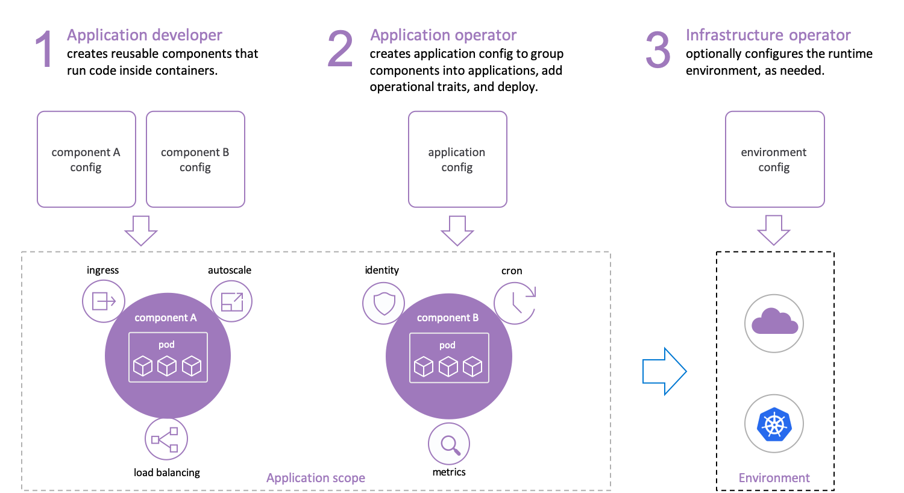

# Open Application Model Specification

Open Application Model (OAM) is a runtime-agnostic specification for defining cloud native applications.

Focused on **application** rather than container or orchestrator, Open Application Model brings modular, extensible, and portable design for modeling application deployment with consistent higher level API. This is the key to enable simple yet robust application delivery workflow across hybrid environments including Kubernetes, cloud, or even IoT devices.

## Introduction

_"Developers think in terms of application architecture, not of infrastructure."_

### Why Open Application Model?

Managing applications without application context is hard:

- Developers spend time on infrastructure details instead of apps - ingress, labels, DNS, etc, and learning how the infrastructure is implemented.
- Inextensible - upper layer platform may be introduced, but it's almost certain that the needs of your app will outgrow the capabilities of that platform soon.
- Runtime lock-in - app description is tightly coupled with the runtime infrastructure, which heavily impact on how you configure, develop and operate the app across hybrid environments.

In Open Application Model, we propose an app-centric approach instead:

- Application first - define the app with a self-contained model, where operational behaviors as part of app definition, free of infrastructure here.
- Clarity and extensibility - an open standard to modularize infrastructure capabilities into reusable pieces that adapts to your needs, not the other way around.
- Runtime agnostic - a consistent experience to deploy and operate your apps across on-prem clusters, cloud providers or even edge devices.

## Read the specification

|                                | Previous Releases | Latest Release |    Working Draft                  |
| :----------------------------: | :-----------------: | :------------: |:--------------------------------: |
| OAM Specification              | [v0.1.0](https://github.com/oam-dev/spec/releases/tag/v0.1.0), [v0.2.1](https://github.com/oam-dev/spec/releases/tag/v0.2.1) | [v0.3.0](SPEC.md) |  --  |

## See it in action

For latest releases (recommend):
- [KubeVela](https://github.com/oam-dev/kubevela): the modern application deployment system based on OAM, with Kubernetes as control plane.

For `v0.1.x` releases:
- [Rudr](https://github.com/oam-dev/rudr): the reference implementation of OAM on Kubernetes.

## Community

### Milestones

To get an overview of the milestones and their description please visit the [Milestones](https://github.com/oam-dev/spec/milestones) page. 

### Triaging 

Triaging of items into milestones will occur during the bi-weekly community call. During this call, issues might be brought into milestones, removed from milestones or moved between milestones. 

### Contributing

See the [CONTRIBUTING](CONTRIBUTING.md) guide for more information about submitting changes to the spec.

One of the easiest ways to contribute is to participate in discussions. There are several ways to get involved.

| Item        | Value  |
|---------------------|---|
| Mailing List | https://groups.google.com/forum/#!forum/oam-dev |
| Bi-weekly OAM Community Call (English) | [Zoom](https://us02web.zoom.us/j/88638962723?pwd=MVhCZnNub2t0R3BmMUNEWE9vendLUT09), [Meeting Notes](https://docs.google.com/document/d/1nqdFEyULekyksFHtFvgvFAYE-0AMHKoS3RMnaKsarjs), [Records (YouTube)](https://www.youtube.com/channel/UCSCTHhGI5XJ0SEhDHVakPAA/)  |
| Bi-weekly APAC Friendly Meeting (Chinese)| [Zoom](https://us02web.zoom.us/j/2804785490?pwd=ZTN4ZU03UTlBZzlmVHIwTndINGM3UT09), [Meeting Notes](https://shimo.im/docs/w8CgdyYGWjtYJ3XP), [Records (BiliBili)](https://space.bilibili.com/180074935?spm_id_from=333.788.b_765f7570696e666f.2) |
| IM Channel      | https://gitter.im/oam-dev/ |
| Twitter      | [@oam_dev](https://twitter.com/oam_dev) |

