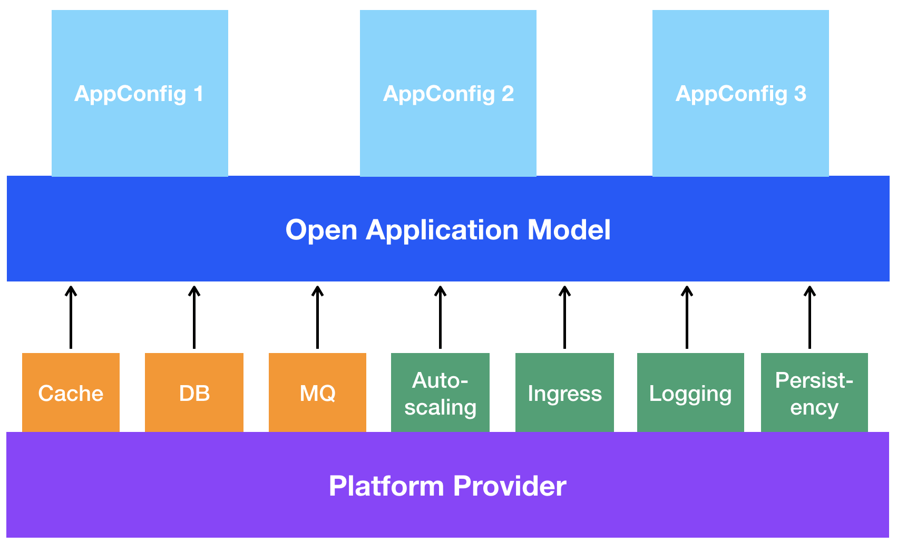

# 导读

本文将通过叙述故事的方式帮助您快速理解OAM（开放应用模型）。

接下来，我们通过一个故事案例来看一个应用交付的生命周期，这个案例包括三个主要过程：

1. 开发人员编写一个Web应用。
2. 应用运维人员部署该Web应用的多个实例，并为这些实例配置一些运维特性，比如自动缩放策略。
3. 基础设施运维人员将决定采用哪些底层技术来支撑应用运维人员所需的运维操作或服务。

## 应用开发人员：编写并测试代码

我们的故事从开发人员创造了一个应用开始，比如一个在线商城应用。开发人员知道如何编写并测试代码，也知道应用运行时需要配置哪些必须的参数，比如日志等级、HTTP端口号等。为了让开发人员将更多精力放在实现应用业务逻辑上，应用运维人员（运维工程师或者自动化运维平台）将承担所有运维工作，这就给开发人员带来一种类似“无服务器化”的体验——开发人员只需开发并打包应用，并将打包后的应用交付给应用运维人员即可。

为了向应用运维人员正确交付应用，开发者必须编写 **组件 （_ComponentSchematic_）** YAML文件。在**开放应用模型**中, 应用的每一个独立组件都被描述在一个 **组件 （_ComponentSchematic_）** YAML文件中，该文件会封装一个 **工作负载（_Workload_）** 对象以及运行该工作负载所必须的信息。举例来说，一个YAML文件可以包含如下信息：
- 一个容器镜像
- 该镜像是否需要一个endpoint
- 该镜像是以何种形式运行，一次性任务还是长期运行
- 该镜像需要哪些环境变量，等等

开发人员通过 **组件（_ComponentSchematic_）** YAML文件把所有他们认为有必要的信息都传递给应用运维人员。

该过程如下图所示

## 应用运维人员: 部署并操作（运维）应用

为了运行并操作应用，应用运维人员为开发人员提供的组件配置相关参数值，并为组件添加运维特性，如实例副本数量、自动缩放容策略、ingress、流量路由规则等，这些信息都被记录在 **应用配置（_ApplicationConfiguration_）** YAML文件中。在OAM的术语定义中，这些运维特性都被统称为 **运维能力（_Traits_）** 。编写并部署 **应用配置（_ApplicationConfiguration_）** YAML文件就等同于部署一个应用。底层平台可以创建多个 **组件（_ComponentSchematic_）** 实例并根据 **应用配置（_ApplicationConfiguration_）** 中的信息为实例赋予相应的运维特性。

该过程如下图所示

## 基础设施运维人员: 配置平台功能

> 译者注：本文档中的“平台 Platform”、是指部署应用并能支撑应用及其运维特性正常工作的平台，如K8S、云平台（公有云、私有云、混合云）等等。

通过以上两个过程，开发人员与应用运维人员已经完成了对应用及其运维特性的描述，并且描述中用到的术语都是“平台中立”的（即 依据该描述文件实施部署运维时，不会依赖于任何特定的平台），接下来，就要由实现了OAM模型的底层平台来发挥作用了。不同的底层平台可以提供一些独有的服务或功能，但是只要这些平台实现了OAM模型，他们在保有自身独特性的同时又具备了相互之间的一致性。

>译者注：所谓“一致性”，假如我们遵循OAM规范说明编写了一份应用描述（包含**组件**与**应用配置**），然后交付给不同的实现了OAM的平台去付诸实施，在实施部署时，各个平台都能 **“读懂”** 这份遵循OAM规范说明的应用描述，并能按照描述中的要求去部署运行应用。

基础设施运维人员负责声明、安装并且维护底层平台的基础服务。举例来说，假如应用将被部署到一个云平台上并向外暴露服务，那基础设施运维人员将会选择特定的负载均衡技术（开发人员和应用运维人员则不需要关心这一点）。

该过程如下图所示

## 致平台建设人员

OAM聚焦于“分离开发与运维关注点”，旨在创造一个“平台中立”的规范说明。OAM带来的模块化、可拓展、可移植的设计理念将帮助用户在K8S等平台上更好地构建并交付应用。

通过OAM，平台建设人员可以向用户提供 **组件**、**运维能力**、**边界** 等可复用的模块。只要将可复用的模块打包到预定义的应用配置文件中，用户就可以根据自己的需求挑选合适的应用配置文件，进而部署并操控应用。举例来说，有的用户需要运行满足高规格SLO需求的微服务应用，有的用户需要运行挂载了数据卷的有状态应用，也有的用户需要运行具有横向自动缩放容特性的事件驱动函数应用，等等。对于终端用户而言，这仿佛是一种基于云原生方式的“无服务器化”体验，而这一切都归功于OAM模块化的设计理念。

对用户而言，另一个好处是他们可以获得“跨平台可移植”的应用。假如一个应用可以部署运行在某一个实现了OAM的平台上，那它一定也可以部署运行在其他实现了OAM的平台上。我们在OAM中定义了不同实现级别的API，分别是**core（核心）**, **standard（标准）**, **extended（扩展）** ，这些API在确保跨平台可移植性的同时，也为平台带来了可拓展性。OAM并非要求一切元素都是跨平台可移植的，OAM所提供的API定义遵循这样一个基本考量：既满足多样需求，又避免引入冗余。 我们的愿景是创造一个**服务商中立、社区主导**的规范说明，我们将积极拥抱业界最流行的API，将更多广泛使用的API引入到OAM中。通过这样的方式，OAM将变得越来越完善，从而帮助更多用户构建云原生应用。
