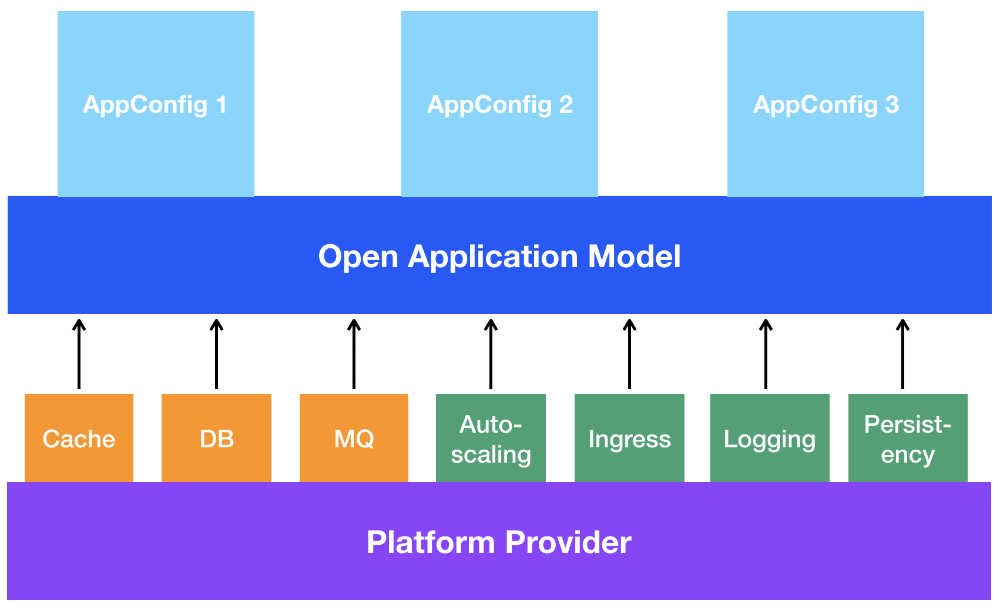
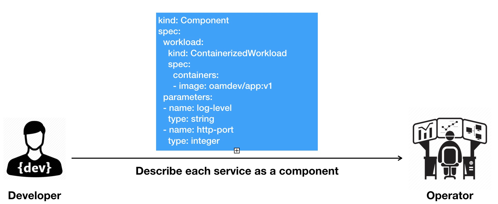
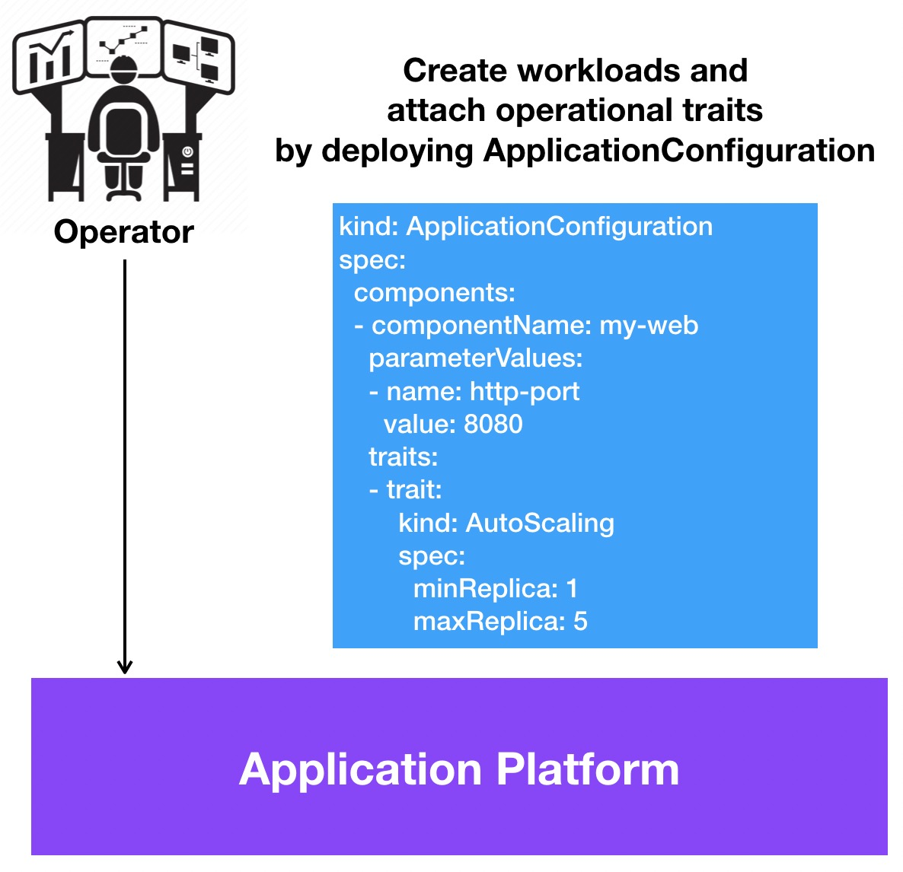

# Personas Introduction

This doc gives an introduction of the personas of Open Application Model in a story-based format. Note that these are extracted from a combination of user stories, research, and user input. While this is not an exhaustive list of possible roles, these are the roles identified as the primary targets for this specification.

- __Developers__ deliver business value in the form of code. While they should understand the operational characteristics of the code they deliver, they are unconcerned with _how_ operational requirements are fulfilled. For instance, a developer may be aware that their code writes data to a specific path on a file system, but need not concern themselves with what kind of volume (disk) is mounted to that path or how that dependency is fulfilled.

- __Application operators__ deliver business value by configuring, installing, and managing components and/or applications such as updating, scaling, auto recovery, etc. Unlike developers and application composers, operators are concerned with _how_ a component or application's operational requirements are fulfilled. For instance, if a developer has declared that a component writes data to a specific path on a file system, an operator may concern themselves with mounting an appropriate volume to that path.

- __Infrastructure operators/Platform builders__ deliver value by building the application centric platform and managing low-level infrastructural components. This may range from managing the physical hardware in an on-premises network to directly managing cloud service offerings in a public cloud. Infrastructure operators are less concerned with the particular configuration needs of _an application_, focusing instead on the big picture of how an enterprise's overall infrastructure is managed. For example, an infrastructure operator may manage the underlying storage offerings that are used for provisioning persistent storage.

We will go through a story that describes an application delivery lifecycle with a OAM based platform. The storyline looks like this:

1. The _infrastructure operator_ decides which underlying workload types and operational capabilities are available on the platform to handle the deployment and operations.
2. The _developer_ creates a web application, defines its characteristics;
3. The _application operator_ or the platform itself instantiate that application, and configures it with operational traits, such as autoscaling;

## Infrastructure operator: configure platform capabilities

The most power of the Open Application Model comes from the underlying platforms that implements the model, which can surface the capabilities that make the underlying platforms unique and useful through OAM in a way that is consistent across any platform that supports the model.

Infrastructure operators are responsible for declaring, installing, and maintaining the underlying capabilities that are available on the platform. For example, an infrastructure operator might choose a specific load balancer technology when deploying to a cloud provider to expose the service.

The following diagram demonstrates the platform architecture:

With OAM, infrastructure operator (or platform builders) can benefit from reusable modules in the format of _Components_, _Traits_, and _Scopes_. This allows platforms to do things like build an application centric platform that expose these higher level abstractions as application level APIs, or assemble them in predefined application templates. In later case, developers could then choose how to run their applications by selecting template, for example, microservice apps with high SLO requirements, stateful apps with persistent volumes, or event driven functions with horizontally autoscaling. This brings a serverless experience to end users in a cloud native way, all due to the modular design.

At the meantime, OAM essentially enables portable application definitions across runtimes. If an app can be deployed and used on one provider, it should be able to run on any other providers. We define must-implement, recommended, and candidate types in _core_, _standard_, and _extended_ APIs. This will ensure portability and provide extensibility in the same spec. Of course, not everything is portable and the primary concern of such an interface is that it is a "lowest-common denominator". Our aspiration is to build a vendor-neutral, community-owned spec and the most popular APIs will be embraced and added to the specification over time. In this way, the evolution will ensure that most users will be successful in defining cloud native applications via the Open Application Model.

## Application developer: Write and test code

The infrastructure operator have so far build a OAM based platform with certain runtime system. The story begins with the application developers who create an application, such as an online shopping application. They know how to write and test the code. The application program takes a few parameters such as log level and HTTP port. To let the developers focus on implementing the application's business logic, we have application operators (either human or automated operation platforms) take care of operational tasks. This provides a "serverless" experience to application developers: they only need to develop and package the application, and then deliver it to application operators to operate

To deliver their applications, developers need to define _Component_ YAML files. In the _Open Application Model_, each individual component of a program is described as a _Component_ YAML by the application developer. This file encapsulates a workload and the information needed to run it. For example, it can contain the container image packaging the program, whether it needs an endpoint, if its designed to run as a task to completion or as a server, environment variables, and any parameters the developers want to expose to an operator to override at deployment time. 

The following diagram demonstrates this workflow:

## Application operator: Deploy and operate applications

To run and operate an application, the application operator sets parameter values for the developers' components and applies operational characteristics, such as replica size, autoscaling policy, ingress points, and traffic routing rules in an _ApplicationConfiguration_ yaml. In OAM, these operational characteristics are called _traits_. Writing and deploying a _ApplicationConfiguration_ yaml is equivalent to deploying an application. The underlying platform will create live instances of defined workloads and attach operational traits to workloads according to the _ApplicationConfiguration_ spec.

The following diagram demonstrates the workflow:

As mentioned in above section, application operator could be the platform itself, i.e. the automated operation platforms will assign traits to components based on intention of application developers. In small organizations, the application operator and application developer could be the same person, but this person still follows the OAM workflow, assign traits in a self-serving approach, and clearly know he/she is configuring a deployable component or operational capability at any time.

### But I don't really have an application operator role

No worries, OAM even helps you better in this case.

It's common in many organizations that application operator role is not a thing. In this context, either the application developers themselves are responsible for configuring traits and deploying the application (e.g. DevOps), or this platform actually goes to "serverless" style so the system will take over from here as long as application artifacts are ready (e.g. NoOps).

In DevOps workflow, clear definition of which piece is application component and which piece is its operational configuration is the key to avoid communications mishaps, bugs, or even service outages due to the mixed mindsets. For example, when rollouting my application component's version, I would choose to disable the autoscaling trait at the meantime.

While in NoOps workflow, OAM is a more natural fit since the platform itself will play the role of application operators and configure traits to components automatically based on the characteristic of the application (e.g. if the component is exposed? if it's replicable?). 

