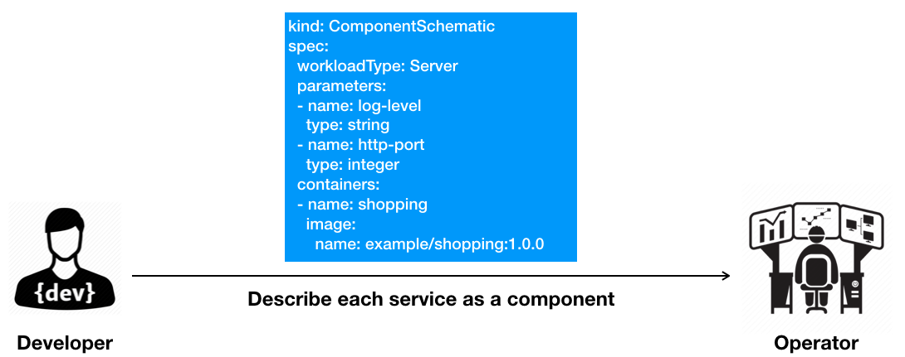
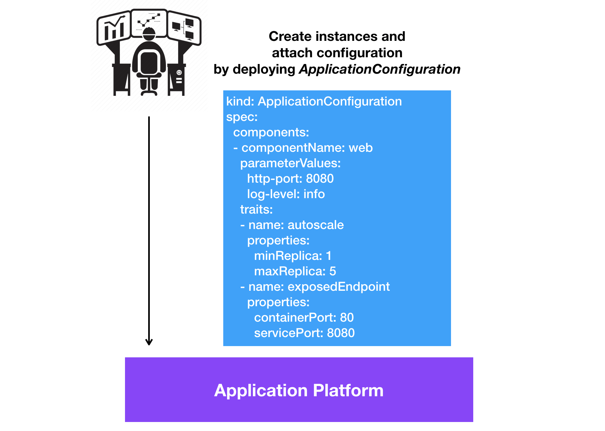

# Introduction

This doc gives an introduction of the specification in a story-based format. It help end users and developers to quickly understand and implement the protocol.

In the following, we are going through a story of application delivery lifecycle. The storyline goes as:

1. The _developer_ creates a web application;
2. The _application operator_ deploys instances of that application, and configures it with operation traits, e.g. autoscaling;
3. The _infrastructure operator_ decides which underlying technology is used to handle the deployment and operations.

## App Developer: Develop Apps

First of all, we have developers who create an online shopping app. They know how to write and test the code. The program takes a few parameters: log level, http port, metrics port. To let the developers focus on development, application operators (either human or automated operation platforms) takes care of the operational tasks. This provides a "serverless" experience to the developers. But, the developers still need to develop and package the application, and deliver it to the application operators.

How app developers deliver it? The answer is that they will define a _ComponentSchematic_ yaml. In _Open Application Model_, each piece of program is described as a _ComponentSchematic_ yaml by app developer. Any information that app operator needs to know about the program will be defined within. For example, the container image packaging the program and the program parameters will be written in a _ComponentSchematic_ yaml. 

The below diagram demonstrates the workflow:

## App Operator: Deploy and Maintain Apps

Deploying an application requires runtime traits configuration and live instances deployment. The app operator applies runtime configuration like replica size, autoscaling policy, which cluster to deploy in a _ApplicationConfiguration_ yaml. Writing and deploying a _ApplicationConfiguration_ yaml is equivalent to deploying an app. The underlying platform will create live instances of _ComponentSchematic_ and attach operational traits to them according to the _ApplicationConfiguration_ spec.

The below diagram demonstrates the workflow:

## Infra Operator: Configure Platform Capabilities

Now that the app operator deploys a _ComponentSchematic_ yaml. How does it happen in real? The power comes from the underlying platforms.

Each platform provides a group of application deployment and operational capabilities. Infrastructure operators are responsible for declaring, installing, and maintaining the underlying services that are available on the platform. For example, infra operator might choose the Load Balancer technology of a specific cloud provider to expose the service.

The below diagram demonstrates the platform architecture:

[Rudr](https://github.com/oam-dev/rudr) is a reference implementation based on Kubernetes. Give it a try to gain hands-on experience.

## The Benefits? Serverless Experience and Portable Apps

Focused on the separation of development concerns from operational considerations through a platform-agnostic specification, _Open Application Model_ brings modular, extensible, and portable design to building and delivering applications on platforms like Kubernetes.

With OAM, platform builders can provide reusable modules in the format of _Components_, _Traits_ etc. and even package them in predefined application profiles. Users choose how to run their applications by selecting profiles, for example, microservice apps with high SLO requirements, stateful apps with persistent volumes, event driven functions with horizontally autoscaling. This brings a serverless experience to end users in a cloud native way, all due to the modular design.

Another benefit for end users is having portable apps across platforms. If an app can be deployed and used on one provider, it should be able to run on any other providers. We define must-implement, recommended, and candidate types in _core_, _standard_, and _extended_ APIs. This will ensure portability and provide extensibility in the same spec. Of course, not everything is portable and the primary concern of such an interface is that it is a "lowest-common denominator". Our aspiration is to build a vendor-neutral, community-owned spec and the most popular APIs will be embraced and added to the specification over time. In this way, the evolution will ensure that most users will be successful in building cloud native applications via the Open Application Model.
